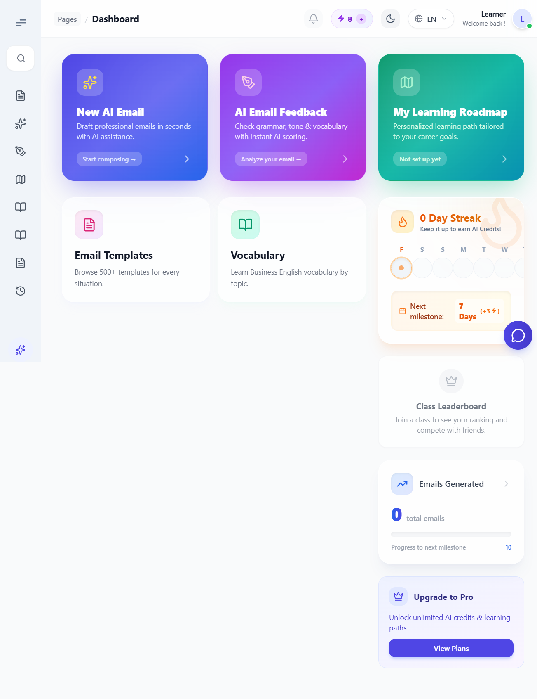
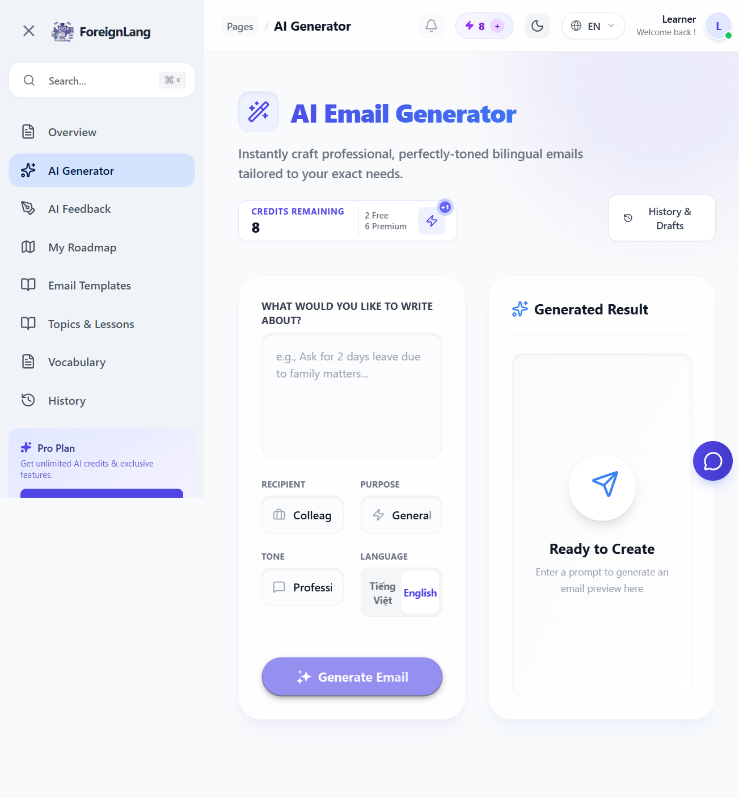
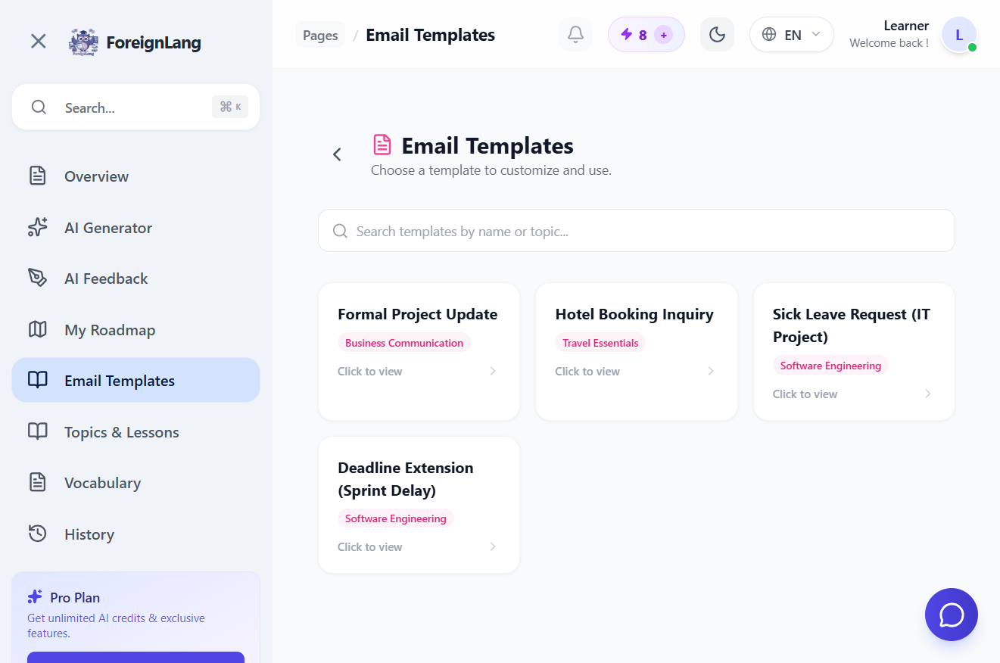
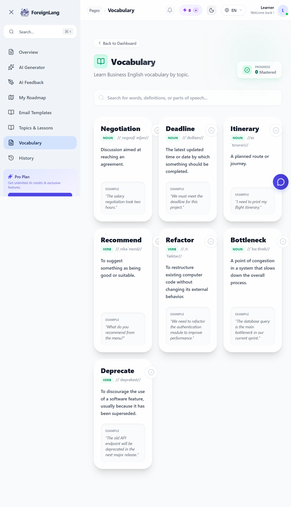

<p align="center">
  
</p>

<h1 align="center">🌐 ForeignLang</h1>

<p align="center">
  <strong>Business English Learning Platform for Professionals</strong>
</p>

<p align="center">
  
  
  
  
  
</p>

---

## 📋 Table of Contents

- [About](#-about)
- [Key Features](#-key-features)
- [Tech Stack](#-tech-stack)
- [Architecture](#-architecture)
- [Prerequisites](#-prerequisites)
- [Installation](#-installation)
- [API Documentation](#-api-documentation)
- [Project Structure](#-project-structure)
- [Screenshots](#-screenshots)
- [Team](#-team)
- [License](#-license)

---

## 💡 About

**ForeignLang** is a full-stack web application designed to solve a critical market pain point for Vietnamese IT professionals: the gap between technical competence and English communication skills.

### The Problem

Vietnamese developers can code brilliantly, but struggle to write professional emails, communicate with international clients, or pass English proficiency assessments. Existing platforms teach general English — not the domain-specific vocabulary and email templates that IT workers actually need.

### The Solution

ForeignLang provides:
- **IT-specialized vocabulary** (deployment, sprint, code review, etc.)
- **AI-powered email generation** using Google Gemini
- **Interactive email templates** with "Mad Libs" style fill-in forms
- **Skill assessment** combining MCQ + AI-evaluated writing
- **Gamification** (streaks, leaderboards, credits) to sustain learning motivation

---

## 🚀 Key Features

| Feature | Description |
|---------|-------------|
| 🔐 **Multi-Auth** | Google OAuth2, Facebook OAuth2, Email/Password with JWT |
| 📧 **AI Email Generator** | Generate professional emails using Gemini AI (customizable tone, language, recipient) |
| 📝 **AI Email Feedback** | Submit emails for AI-powered grammar, tone, and vocabulary analysis |
| 📄 **Email Templates** | Interactive "Mad Libs" forms with real-time live preview and copy protection |
| 📚 **IT Vocabulary Bank** | Curated word lists with pronunciation (Web Speech API), mastery tracking |
| 🎯 **Skill Assessment** | MCQ tests + AI writing evaluation → proficiency level assignment |
| 🗺️ **Learning Roadmap** | Personalized learning paths based on assessment results |
| 🏆 **Gamification** | Daily streaks, group leaderboards, AI credit rewards |
| 💳 **Payments** | VietQR (SePay) integration for credit purchases and subscriptions |
| 🤖 **AI Chatbot** | Learning consultant powered by Gemini AI |
| 🔔 **Notifications** | Real-time notification system with unread tracking |
| 🌙 **Dark Mode** | Full dark/light theme toggle |
| 🌐 **i18n** | English and Vietnamese language support |
| 👨‍💼 **Admin Panel** | User management, content approvals, analytics dashboard |
| 👩‍🏫 **Teacher Portal** | Topic submission, lesson editing, student group management |

---

## 🛠️ Tech Stack

### Frontend
| Technology | Purpose |
|-----------|---------|
| React 19 | UI framework |
| TypeScript | Type safety |
| Vite 7 | Build tool & dev server |
| React Router v7 | Client-side routing |
| Tailwind CSS v4 | Utility-first styling |
| Framer Motion | Animations & transitions |
| React Context API | Global state (Auth, Credits, Theme) |
| react-i18next | Internationalization |
| Sonner | Toast notifications |
| Lucide React | Icon library |

### Backend
| Technology | Purpose |
|-----------|---------|
| Java 21 | Runtime |
| Spring Boot 3.4 | Application framework |
| Spring Security | Authentication & authorization |
| Spring Data JPA | Database ORM |
| PostgreSQL 16 | Primary database |
| Hibernate | JPA implementation |
| Lombok | Boilerplate reduction |
| Google Gemini API | AI email generation & feedback |
| OAuth2 Client | Google & Facebook login |
| JWT (JSON Web Token) | Token-based auth |
| Docker Compose | PostgreSQL containerization |

### DevOps & Tools
| Technology | Purpose |
|-----------|---------|
| Docker Compose | Database container |
| Maven Wrapper | Build management |
| SePay API | VietQR payment processing |
| Postman | API testing |

---

## 🏗️ Architecture

```
┌────────────────────────┐     ┌──────────────────────────┐
│    React Frontend      │     │   Spring Boot Backend    │
│  (Vite + TypeScript)   │────▶│  (Java 21 + JPA + JWT)  │
│  Port: 5173            │     │  Port: 8080              │
└────────────────────────┘     └──────────┬───────────────┘
                                          │
                         ┌────────────────┼────────────────┐
                         │                │                │
                  ┌──────▼──────┐  ┌──────▼──────┐  ┌─────▼──────┐
                  │ PostgreSQL  │  │ Gemini AI   │  │ SePay API  │
                  │ (Docker)    │  │ (Google)    │  │ (VietQR)   │
                  │ Port: 5434  │  │             │  │            │
                  └─────────────┘  └─────────────┘  └────────────┘
```

---

## 📦 Prerequisites

Before you begin, ensure you have the following installed:

| Requirement | Version | Check |
|------------|---------|-------|
| **Node.js** | 18+ | `node -v` |
| **npm** | 9+ | `npm -v` |
| **Java JDK** | 21+ | `java -version` |
| **Docker Desktop** | Latest | `docker --version` |
| **Git** | Latest | `git --version` |

### External API Keys (Optional)

| Service | Required? | Purpose |
|---------|-----------|---------|
| Google OAuth2 | ✅ For Google Login | [Google Cloud Console](https://console.cloud.google.com/) |
| Facebook OAuth2 | Optional | [Facebook Developers](https://developers.facebook.com/) |
| Gemini AI | Optional | AI features (mock mode available) |
| SePay | Optional | VietQR payment processing |

---

## 🚀 Installation

### Step 1: Clone the Repository

```bash
git clone https://github.com/your-org/ForeignLang.git
cd ForeignLang
```

### Step 2: Start PostgreSQL Database

```bash
# Docker Compose will auto-start with Spring Boot, OR run manually:
docker compose up -d
```

This starts PostgreSQL on **port 5434** with:
- Database: `foreignlang`
- Username: `postgres`
- Password: `password`

### Step 3: Configure Environment Variables

```bash
# Backend: Copy and edit the env template
cp .env.example .env
# Edit .env → Fill in GOOGLE_CLIENT_ID, GOOGLE_CLIENT_SECRET, etc.

# Frontend: Copy and edit
cp frontend/.env.example frontend/.env
```

> **Quick Start**: The app works without API keys! Set `GEMINI_MOCK_ENABLED=true` in `application.properties` to use mock AI responses.

### Step 4: Start Backend Server

```bash
# From project root (uses Maven Wrapper, no Maven install needed)
./mvnw spring-boot:run
```

The backend starts on **http://localhost:8080** and auto-creates database tables + seeds sample data.

### Step 5: Start Frontend Dev Server

```bash
# Open a new terminal
cd frontend
npm install
npm run dev
```

The frontend starts on **http://localhost:5173** with hot reload.

### Step 6: Open the App

Visit **http://localhost:5173** in your browser.

Default test accounts (created by DataSeeder):
| Email | Password | Role |
|-------|----------|------|
| `admin@foreignlang.com` | `admin123` | ADMIN |
| `teacher@foreignlang.com` | `teacher123` | TEACHER |
| `learner@foreignlang.com` | `learner123` | LEARNER |

---

## 📡 API Documentation

A comprehensive Postman Collection is included at the project root:

```
📁 ForeignLang_API_Collection.json
```

### Import into Postman:
1. Open Postman → **Import** → Select `ForeignLang_API_Collection.json`
2. Set Collection Variable `base_url` = `http://localhost:8080`
3. Login via `POST /api/v1/auth/login` → Copy the JWT token
4. Set Collection Variable `jwt_token` = copied token

### API Folder Structure:
| # | Folder | Endpoints |
|---|--------|-----------|
| 1 | Auth | Register, Login, OAuth2, Password Reset |
| 2 | User Profile | Me, Update, Password, Upgrade, Transactions |
| 3 | Content | Topics, Lessons, Vocabulary (CRUD) |
| 4 | Email Templates | List, By Topic, By ID |
| 5 | AI Features | Generate Email, Feedback, Ad Reward, History |
| 6 | Assessment | MCQ Submit, AI Writing Evaluation |
| 7 | Subscription | Status, Create, Cancel, Watch Ad |
| 8 | Chat | Sessions, Messages, History |
| 9 | Notifications | List, Unread Count, Mark Read |
| 10 | Search | Global Search |
| 11 | Admin | Stats, Users, Approvals, Groups |

---

## 📁 Project Structure

```
ForeignLang/
├── 📁 frontend/                    # React + TypeScript + Vite
│   ├── 📁 src/
│   │   ├── 📁 components/         # Reusable UI components
│   │   │   ├── 📁 gamification/   # Streak, Leaderboard
│   │   │   ├── 📁 role/           # Role-based switchers
│   │   │   └── 📁 ui/             # CreditDropdown, Loader, Toggle
│   │   ├── 📁 contexts/           # AuthContext, CreditContext, ThemeContext
│   │   ├── 📁 layouts/            # DashboardLayout (sidebar, navbar)
│   │   ├── 📁 pages/              # Route-level page components
│   │   │   ├── 📁 admin/          # Admin dashboard, user mgmt
│   │   │   ├── 📁 dashboard/      # Settings, Upgrade, Email Generator
│   │   │   ├── 📁 onboarding/     # Skill assessment flow
│   │   │   └── 📁 teacher/        # Teacher lesson editor
│   │   ├── 📁 locales/            # i18n translation files (en, vi)
│   │   ├── App.tsx                # Route definitions
│   │   └── main.tsx               # Entry point
│   ├── .env.example
│   ├── package.json
│   ├── tailwind.config.js
│   └── vite.config.ts
│
├── 📁 src/main/java/.../backend/   # Spring Boot Backend
│   ├── 📁 config/                  # SecurityConfig, DataSeeder
│   ├── 📁 controller/             # REST API controllers (21 files)
│   ├── 📁 dto/                    # Data Transfer Objects
│   ├── 📁 entity/                 # JPA entities
│   ├── 📁 repository/            # Spring Data repositories
│   ├── 📁 security/              # JWT, OAuth2, UserPrincipal
│   ├── 📁 seeder/                # ContentDataSeeder (vocab, templates)
│   └── 📁 service/               # Business logic services
│
├── 📁 src/main/resources/
│   ├── application.properties     # Server configuration
│   └── data.sql                   # Initial SQL data
│
├── .env.example                    # Backend env template
├── docker-compose.yml              # PostgreSQL container
├── ForeignLang_API_Collection.json # Postman API collection
├── pom.xml                         # Maven dependencies
└── README.md                       # This file
```

---

## 📸 Screenshots

> Replace the placeholders below with actual screenshots of the UI.

### Dashboard


### AI Email Generator


### Email Templates (Mad Libs Form)


### Vocabulary Bank


### Skill Assessment


### Admin Panel


---

## 👥 Team

| Member | Role | Responsibility |
|--------|------|----------------|
| Tran Nguyen Hoang Le | Project Lead | Architecture, Backend, AI Integration |
| Nguyen Minh Triet | Frontend Dev | UI/UX Implementation, AI Integration |
| Le Minh Huy | Backend Dev | API Development |
| Van Quang Truong | Backend Dev, QA/Testing | Quality Assurance |
| Team Member 5 | Design | UI/UX Design |

> *FPT University — EXE101 Course — Spring 2026*

---

## 📄 License

This project is developed as part of the **EXE101** course at **FPT University**.

```
MIT License — See LICENSE file for details.
```

---

<p align="center">
  <sub>Built with ❤️ by the FiveFusion Team · FPT University · 2026</sub>
</p>
